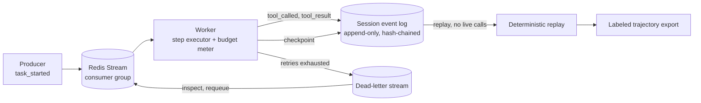

# ratchet

Agents that survive `kill -9`.

ratchet is a durable, queue-native runtime for AI agents: checkpointed, replayable, budget-capped
step execution built on message-queue engineering rather than a workflow DSL. If each step of an
8-step agent loop independently succeeds 85% of the time, the loop completes end to end only about
27% of the time, which is a large part of why so many agent projects stall before production.
Reliability at that layer is a distributed-systems problem: retries, idempotency, dead-letter
queues, backpressure, and checkpoint/resume. ratchet is a reference implementation of that layer,
sitting underneath whatever agent loop you already have.

## Status

Early stage. The design is complete and implementation proceeds milestone by milestone (see
Roadmap). The current focus is the session event log and a Redis Streams executor, both of which
run with stubbed steps and no model calls.

## Architecture



## Why this exists

- Compounding per-step failure is what breaks agents in production rather than in demos, and
  reliability engineering is the named gap
  ([why agent projects fail](https://www.digitalapplied.com/blog/88-percent-ai-agents-never-reach-production-failure-framework)).
- Durable execution is the missing layer, as Temporal frames it, but their answer is a general
  workflow DSL rather than an agent-native one
  ([AI reliability is a decade-old problem](https://temporal.io/blog/ai-reliability-is-a-decade-old-problem)).
- Anthropic's managed-agents architecture separates brain, hands, and session into independently
  failable parts, with the session as a durable append-only event log
  ([managed agents](https://www.anthropic.com/engineering/managed-agents)). ratchet implements that
  session layer as an open, inspectable system.
- Multi-agent fan-out is expensive and often loses to a well-engineered single agent, at roughly
  15x the token cost
  ([multi-agent research system](https://www.anthropic.com/engineering/built-multi-agent-research-system)).
  ratchet prioritizes single-agent reliability and makes that cost trade-off visible per step.

## What the first release delivers

The first release delivers, with stubbed steps and no model calls: an append-only, hash-chained
session event log; a Redis Streams consumer-group executor with at-least-once delivery; checkpoint
and resume that survive a worker `kill -9` in a chaos test suite; a dead-letter stream for
exhausted retries; and idempotency keys that guarantee zero duplicate side effects under retry. The
real agent loop, tool layer, budgets, tracing, and additional brokers follow.

## Roadmap

1. Session event-log schema and a Redis Streams consumer-group executor (stubbed steps).
2. Checkpoint and resume, a `kill -9` chaos suite, and a dead-letter stream.
3. Idempotency keys, retry policies, and a backpressure governor.
4. A real agent loop (plan, act, reflect) on top of the runtime.
5. A tool layer with per-tool idempotency contracts.
6. Per-step budgets, cost attribution, and a RabbitMQ adapter.
7. Tracing and a Kafka event log.
8. Deterministic replay exported as labeled trajectories.

## Development

```bash
uv sync
make check       # lint, typecheck, test
make docker-build
docker compose up
```

## License

Apache-2.0. See [LICENSE](LICENSE).
