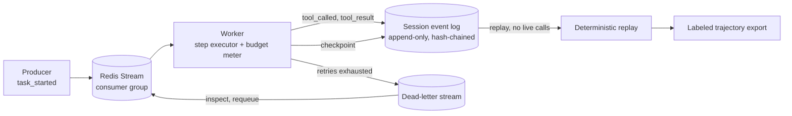

# ratchet

Agents that survive `kill -9`.

ratchet is a durable, queue-native runtime for AI agents: checkpointed, replayable, budget-capped
step execution built on message-queue engineering rather than a workflow DSL. If each step of an
8-step agent loop independently succeeds 85% of the time, the loop completes end to end only about
27% of the time, which is a large part of why so many agent projects stall before production.
Reliability at that layer is a distributed-systems problem: retries, idempotency, dead-letter
queues, backpressure, and checkpoint/resume. ratchet is a reference implementation of that layer,
sitting underneath whatever agent loop you already have.

## Status

Early stage. The design is complete and implementation proceeds milestone by milestone (see
Roadmap). Milestones 1 and 2 have landed: the append-only hash-chained session event log (atomic
compare-and-append, fork detection, full-chain verification); the Redis Streams consumer-group
executor (explicit XREADGROUP/XACK/PEL handling behind a thin broker interface); multi-step task
plans with a checkpoint event after every completed step; log-derived resume, where a second
worker claims (XAUTOCLAIM) a task abandoned by a killed worker and finishes it without re-running
completed steps; a dead-letter stream for failed steps, inspectable and requeueable; and a chaos
test suite that kills real worker subprocesses with SIGKILL mid-step and measures recovery time.
Steps are still stubbed, with no model calls. Next up: idempotency-key enforcement, retry
policies, and a backpressure governor.

## Architecture



## Why this exists

- Compounding per-step failure is what breaks agents in production rather than in demos, and
  reliability engineering is the named gap
  ([why agent projects fail](https://www.digitalapplied.com/blog/88-percent-ai-agents-never-reach-production-failure-framework)).
- Durable execution is the missing layer, as Temporal frames it, but their answer is a general
  workflow DSL rather than an agent-native one
  ([AI reliability is a decade-old problem](https://temporal.io/blog/ai-reliability-is-a-decade-old-problem)).
- Anthropic's managed-agents architecture separates brain, hands, and session into independently
  failable parts, with the session as a durable append-only event log
  ([managed agents](https://www.anthropic.com/engineering/managed-agents)). ratchet implements that
  session layer as an open, inspectable system.
- Multi-agent fan-out is expensive and often loses to a well-engineered single agent, at roughly
  15x the token cost
  ([multi-agent research system](https://www.anthropic.com/engineering/built-multi-agent-research-system)).
  ratchet prioritizes single-agent reliability and makes that cost trade-off visible per step.

## What the first release delivers

The first release delivers, with stubbed steps and no model calls: an append-only, hash-chained
session event log; a Redis Streams consumer-group executor with at-least-once delivery; checkpoint
and resume that survive a worker `kill -9` in a chaos test suite; a dead-letter stream for
exhausted retries; and idempotency keys that guarantee zero duplicate side effects under retry. The
real agent loop, tool layer, budgets, tracing, and additional brokers follow.

## Roadmap

1. Session event-log schema and a Redis Streams consumer-group executor (stubbed steps).
2. Checkpoint and resume, a `kill -9` chaos suite, and a dead-letter stream.
3. Idempotency keys, retry policies, and a backpressure governor.
4. A real agent loop (plan, act, reflect) on top of the runtime.
5. A tool layer with per-tool idempotency contracts.
6. Per-step budgets, cost attribution, and a RabbitMQ adapter.
7. Tracing and a Kafka event log.
8. Deterministic replay exported as labeled trajectories.

## Try it: kill -9 a worker mid-task

With a local Redis (`docker compose up -d redis`, which enables AOF persistence):

```bash
uv sync
uv run python -m ratchet chaos
```

The chaos showcase publishes one task with a three-step plan (fetch, transform, save), starts a
worker, and kills it with SIGKILL in the middle of the transform step - no shutdown hook, no
cleanup, the same failure a crashed pod or an OOM kill produces. A second worker claims the
abandoned message from the consumer group's pending list once it has sat idle past the visibility
timeout (`min_idle_ms=1000` here), replays the session event log, and resumes from the last
checkpoint. Output from a real run:

```
ratchet worker ready consumer=w1 pid=9776
killed worker consumer=w1 pid=9776 mid-step (transform)
ratchet worker ready consumer=w2 pid=9777
INFO ratchet.executor session_id=chaos-c01ddc73 consumer=w2 steps=3 outcome=ok resumed=yes
chain=task_started,step_planned,tool_called,tool_result,checkpoint,step_planned,tool_called,resumed,step_planned,tool_called,tool_result,checkpoint,step_planned,tool_called,tool_result,checkpoint,task_done
resumed payload={'cursor': 1, 'consumer': 'w2'}
recovery_seconds=3.07
chain verified
pending=0
```

Reading the chain: fetch completes and checkpoints; transform's `tool_called` is the last event
the first worker wrote before dying; `resumed` marks the second worker taking over at cursor 1,
re-running only the interrupted transform step (fetch is not re-run) and continuing through save
to `task_done`. Recovery took 3.07 seconds, most of it the 1-second idle threshold plus re-running
the 2-second transform step. The hash chain verifies end to end and the pending list is empty. The
same scenario runs as an automated chaos suite (part of `make check`) that kills real worker
subprocesses and asserts every completed step ran exactly once.

The multi-session demo drains five single-step sessions with two workers, appends each step's
lifecycle to its session's hash-chained event log, and verifies every chain:

```bash
uv run python -m ratchet demo --sessions 5 --workers 2
```

```
INFO ratchet.executor session_id=demo-dc607506-0 consumer=w0 steps=1 outcome=ok resumed=no
INFO ratchet.executor session_id=demo-dc607506-1 consumer=w0 steps=1 outcome=ok resumed=no
INFO ratchet.executor session_id=demo-dc607506-2 consumer=w0 steps=1 outcome=ok resumed=no
INFO ratchet.executor session_id=demo-dc607506-3 consumer=w0 steps=1 outcome=ok resumed=no
INFO ratchet.executor session_id=demo-dc607506-4 consumer=w0 steps=1 outcome=ok resumed=no
session=demo-dc607506-0 status=done chain=verified events=task_started,step_planned,tool_called,tool_result,checkpoint,task_done
session=demo-dc607506-1 status=done chain=verified events=task_started,step_planned,tool_called,tool_result,checkpoint,task_done
session=demo-dc607506-2 status=done chain=verified events=task_started,step_planned,tool_called,tool_result,checkpoint,task_done
session=demo-dc607506-3 status=done chain=verified events=task_started,step_planned,tool_called,tool_result,checkpoint,task_done
session=demo-dc607506-4 status=done chain=verified events=task_started,step_planned,tool_called,tool_result,checkpoint,task_done
sessions=5 done=5 failed=0 incomplete=0 workers=2
all session event chains verified
```

Fully containerized, the same demo runs with `docker compose up --build app`.

## Development

```bash
uv sync
docker compose up -d redis
make check       # lint, typecheck, test (integration tests need the redis service)
make docker-build
```

## License

Apache-2.0. See [LICENSE](LICENSE).
